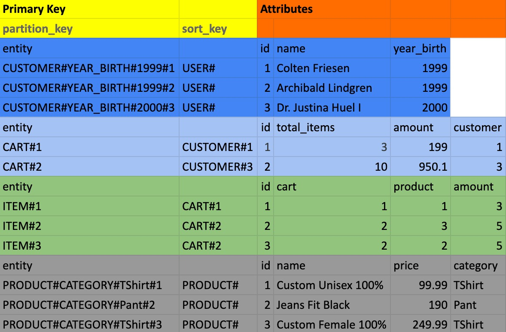

# Amazon DynamoDB POC with TypeScript and Node.js

This project is just for learning and test proposals. Do not use it in production.

Testing DynamoDB maineset using Node.js with TypeScript via testing using Jest (test tool).

## Context

### Business Domain

The business domain used in the POC was the shopping cart domain.

The table modeling has the following entities: 
- Customer
- Cart
- Item
- Product

The model built was to solve the following queries: 
- Search for all customers 
- Search for all customers born in 1999
- Search for all products 
- Search for a customer's shopping cart
- Search for all items in a shopping cart 
- Search the total value of a cart

#### View of the table with the entities and their attributes


## Configuration and Running

### Dependencies

- Node v17.9.0
- Docker

### Running DynamoDB
##### Download the DynamoDB container image (Only need for the very first time)
```
docker pull amazon/dynamodb-local
```
##### Create network for script execution
```
docker network create --driver=bridge dynamodb-local
```
##### Start the local DynamoDB container
```
docker run --rm -d -p 8000:8000 --network dynamodb-local --name dynamodb-local amazon/dynamodb-local
```

### Setup
##### Download or clone this repository, then
```
cd dynamodb-node-ts
```
##### Install dependencies
```
npm install
```
 
##### Initialize table creation
```
npm run db:create-table
```

##### Load table with data fakes
```
npm run db:load-table
```
```
output:
database loaded successfully 🚀
```

#### Test
##### Run all test suites
```
npm test
```
```
output:
  tests on shopping cart database
    ✓ Should return list all customers (60 ms)
    ✓ Should return list all customers who were born in the year 1999 (21 ms)
    ✓ Should return list all products (17 ms)
    ✓ Should return cart by customer (15 ms)
    ✓ Should return items by cart (14 ms)
    ✓ should return amount of the cart (11 ms)

Test Suites: 1 passed, 1 total
Tests:       6 passed, 6 total
Snapshots:   0 total
Time:        0.671 s, estimated 1 s
Ran all test suites.
```

### DynamoDB CLI - Some Commands

##### List tables
```
docker run --rm -it --network dynamodb-local -e AWS_DEFAULT_REGION=us-east-1 -e AWS_ACCESS_KEY_ID=local -e AWS_SECRET_ACCESS_KEY=local amazon/aws-cli dynamodb list-tables --endpoint-url http://dynamodb-local:8000

output:
{
    "TableNames": [
        "shopping-cart"
    ]
}
```
##### List all items
```
docker run --rm -it --network dynamodb-local -e AWS_DEFAULT_REGION=us-east-1 -e AWS_ACCESS_KEY_ID=local -e AWS_SECRET_ACCESS_KEY=local amazon/aws-cli dynamodb scan --table-name shopping-cart --endpoint-url http://dynamodb-local:8000
```
<details >
<summary style="font-size:14px">View output</summary>
{
    "Items": [
        {
            "name": {
                "S": "Archibald Lindgren"
            },
            "id": {
                "N": "2"
            },
            "partition_key": {
                "S": "CUSTOMER#YEAR_BIRTH#1999#2"
            },
            "sort_key": {
                "S": "USER#"
            },
            "year_birth": {
                "N": "1999"
            }
        },
        {
            "product": {
                "N": "1"
            },
            "amount": {
                "N": "3"
            },
            "id": {
                "N": "1"
            },
            "partition_key": {
                "S": "ITEM#1"
            },
            "sort_key": {
                "S": "CART#1"
            },
            "cart": {
                "N": "1"
            }
        },
        {
            "name": {
                "S": "Jeans Fit Black"
            },
            "id": {
                "N": "2"
            },
            "partition_key": {
                "S": "PRODUCT#CATEGORY#Pant#2"
            },
            "sort_key": {
                "S": "PRODUCT#"
            },
            "category": {
                "S": "Pant"
            },
            "price": {
                "N": "190"
            }
        },
        {
            "amount": {
                "N": "950.1"
            },
            "id": {
                "N": "2"
            },
            "partition_key": {
                "S": "CART#2"
            },
            "sort_key": {
                "S": "CUSTOMER#3"
            },
            "total_items": {
                "N": "10"
            },
            "customer": {
                "N": "3"
            }
        },
        {
            "product": {
                "N": "3"
            },
            "amount": {
                "N": "5"
            },
            "id": {
                "N": "2"
            },
            "partition_key": {
                "S": "ITEM#2"
            },
            "sort_key": {
                "S": "CART#2"
            },
            "cart": {
                "N": "2"
            }
        },
        {
            "name": {
                "S": "Dr. Justina Huel I"
            },
            "id": {
                "N": "3"
            },
            "partition_key": {
                "S": "CUSTOMER#YEAR_BIRTH#2000#3"
            },
            "sort_key": {
                "S": "USER#"
            },
            "year_birth": {
                "N": "2000"
            }
        },
        {
            "amount": {
                "N": "199"
            },
            "id": {
                "N": "1"
            },
            "partition_key": {
                "S": "CART#1"
            },
            "sort_key": {
                "S": "CUSTOMER#1"
            },
            "total_items": {
                "N": "5"
            },
            "customer": {
                "N": "1"
            }
        },
        {
            "name": {
                "S": "Custom Unisex 100%"
            },
            "id": {
                "N": "1"
            },
            "partition_key": {
                "S": "PRODUCT#CATEGORY#TShirt#1"
            },
            "sort_key": {
                "S": "PRODUCT#"
            },
            "category": {
                "S": "TShirt"
            },
            "price": {
                "N": "99.99"
            }
        },
        {
            "name": {
                "S": "Custom Female 100%"
            },
            "id": {
                "N": "3"
            },
            "partition_key": {
                "S": "PRODUCT#CATEGORY#TShirt#3"
            },
            "sort_key": {
                "S": "PRODUCT#"
            },
            "category": {
                "S": "TShirt"
            },
            "price": {
                "N": "249.99"
            }
        },
        {
            "product": {
                "N": "2"
            },
            "amount": {
                "N": "5"
            },
            "id": {
                "N": "3"
            },
            "partition_key": {
                "S": "ITEM#3"
            },
            "sort_key": {
                "S": "CART#2"
            },
            "cart": {
                "N": "2"
            }
        },
        {
            "name": {
                "S": "Colten Friesen"
            },
            "id": {
                "N": "1"
            },
            "partition_key": {
                "S": "CUSTOMER#YEAR_BIRTH#1999#1"
            },
            "sort_key": {
                "S": "USER#"
            },
            "year_birth": {
                "N": "1999"
            }
        }
    ],
    "Count": 11,
    "ScannedCount": 11,
    "ConsumedCapacity": null
}

</details>

##### Returns information about the table, including the current status of the table, when it was created, the primary key schema, and any indexes on the table.
```
docker run --rm -it --network dynamodb-local -e AWS_DEFAULT_REGION=us-east-1 -e AWS_ACCESS_KEY_ID=local -e AWS_SECRET_ACCESS_KEY=local amazon/aws-cli dynamodb describe-table --table-name shopping-cart --endpoint-url http://dynamodb-local:8000
```
<details >
<summary style="font-size:14px">View output</summary>

{
    "Table": {
        "AttributeDefinitions": [
            {
                "AttributeName": "partition_key",
                "AttributeType": "S"
            },
            {
                "AttributeName": "sort_key",
                "AttributeType": "S"
            }
        ],
        "TableName": "shopping-cart",
        "KeySchema": [
            {
                "AttributeName": "partition_key",
                "KeyType": "HASH"
            },
            {
                "AttributeName": "sort_key",
                "KeyType": "RANGE"
            }
        ],
        "TableStatus": "ACTIVE",
        "CreationDateTime": "2022-09-26T10:05:44.119000-03:00",
        "ProvisionedThroughput": {
            "LastIncreaseDateTime": "1969-12-31T21:00:00-03:00",
            "LastDecreaseDateTime": "1969-12-31T21:00:00-03:00",
            "NumberOfDecreasesToday": 0,
            "ReadCapacityUnits": 5,
            "WriteCapacityUnits": 5
        },
        "TableSizeBytes": 895,
        "ItemCount": 11,
        "TableArn": "arn:aws:dynamodb:ddblocal:000000000000:table/shopping-cart",
        "GlobalSecondaryIndexes": [
            {
                "IndexName": "sort_key",
                "KeySchema": [
                    {
                        "AttributeName": "sort_key",
                        "KeyType": "HASH"
                    },
                    {
                        "AttributeName": "partition_key",
                        "KeyType": "RANGE"
                    }
                ],
                "Projection": {
                    "ProjectionType": "ALL"
                },
                "IndexStatus": "ACTIVE",
                "ProvisionedThroughput": {
                    "ReadCapacityUnits": 10,
                    "WriteCapacityUnits": 5
                },
                "IndexSizeBytes": 895,
                "ItemCount": 11,
                "IndexArn": "arn:aws:dynamodb:ddblocal:000000000000:table/shopping-cart/index/sort_key"
            }
        ]
    }
}

</details>

## References
 - <a href="https://docs.aws.amazon.com/amazondynamodb/latest/developerguide/Introduction.html">What is Amazon DynamoDB?</a>
 - <a href="https://aws.amazon.com/pt/cli/">AWS CLI Command</a>
 - <a href="https://docs.aws.amazon.com/amazondynamodb/latest/developerguide/GettingStarted.html">Getting started with DynamoDB and AWS SDKs</a>
 - <a href="https://docs.aws.amazon.com/AWSJavaScriptSDK/latest/AWS/DynamoDB/DocumentClient.html">AWS DynamoDB Document Client</a>
 - <a href="https://docs.aws.amazon.com/amazondynamodb/latest/developerguide/DynamoDBLocal.html">Setting up DynamoDB local (downloadable version)</a>
 - <a href="https://aws.amazon.com/getting-started/hands-on/create-nosql-table/?nc1=h_ls">Create and Query a NoSQL Table with Amazon DynamoDB</a>
 - <a href="https://docs.aws.amazon.com/amazondynamodb/latest/developerguide/SQLtoNoSQL.html">From SQL to NoSQL</a>


